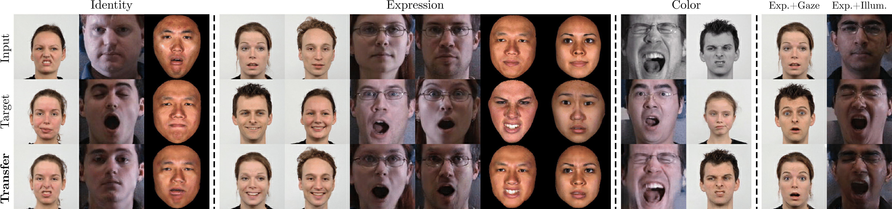
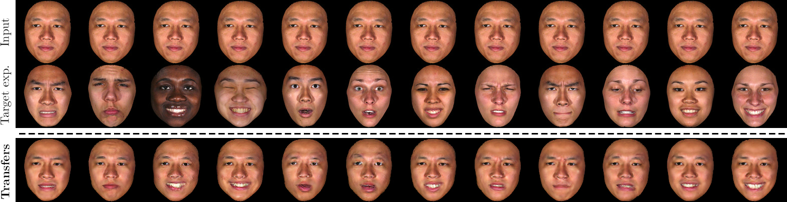

# Adversarial Learning of Disentangled and Generalizable Representations for Visual Attributes

Code to reproduce the results in the paper [*"Adversarial Learning of Disentangled and Generalizable Representations for Visual Attributes*"](https://arxiv.org/abs/1904.04772). We propose a method for learning generalizable and disentangled latent representations that can be utilized for tasks including intensity-preserving multi-attribute image transfer.



## dependencies

````bash
$ pip install natsort funcy tensorflow==1.4.0
````

## Attribute Transfers

To replicate our test set attribute transfers for the expression attribute:

### (1) prepare data

Assuming you have the datasets downloaded locally, prepare them with:

````bash
# BU-3DFE:
$ python scripts/prepare_bu.py --data_path="/bu/root/directory/"
# MultiPIE:
$ python scripts/prepare_multi.py --data_path="/multipie/root/directory/"
# RaFD:
$ python scripts/prepare_rafd.py --data_path="/rafd/root/directory/"
````

See `./scripts/readme.md` for additional information on expected vendor structure of root folders.

### (2) Download the pre-trained models

Download the pre-trained models for all datasets with the following:

````bash
$ wget -r -np -nH --cut-dirs=2 -R *index* http://igor.gold.ac.uk/~joldf001/adv-dis/checkpoints/
````

### (2) Generate the transfers



Use the script below to replicate our test set expression transfers for a particular target image:

```bash
$ python experiments/generate_transfers.py \
  --from_checkpoint="checkpoints/bu/model.ckpt-75" \
  --input_files="./data-bu/test/0061-0004-0000-1548.jpg" \
  --target_files="./data-bu/test/" \
  --n_attributes=2 \
  --attribute_names="id,exp" \
  --db="bu"
```

or transfer expressions onto the entire e.g. test split:

```bash
$ python experiments/generate_transfers.py \
  --from_checkpoint="checkpoints/multi/2-att/model.ckpt-75" \
  --input_files="./data-multi/test/" \
  --target_files="./data-multi/train/" \
  --n_attributes=2 \
  --attribute_names="id,exp" \
  --db="multi"
```

## Joint Interpolation and Transfer

To jointly interpolate between expression encodings, and simultaneously transfer the resulting convex combination onto a new identity, run the following:

```bash
python experiments/generate_exp_interpolations.py \
  --from_checkpoint="checkpoints/multi/2-att/model.ckpt-75" \
  --input_files="./data-multi/train/" \
  --n_attributes=2 \
  --attribute_names="id,exp" \
  --db="multi"
```

## Citation 
If this work is useful for your research, please cite our [paper](https://arxiv.org/abs/1904.04772):


```
@ARTICLE{arXiv190404772O2019,
  author = {{Oldfield}, James and {Panagakis}, Yannis and {Nicolaou}, Mihalis A.},
  title = "{Adversarial Learning of Disentangled and Generalizable Representations for Visual Attributes}",
  journal = {arXiv:1904.04772 [cs.CV]},
  year = "2019",
}
```
